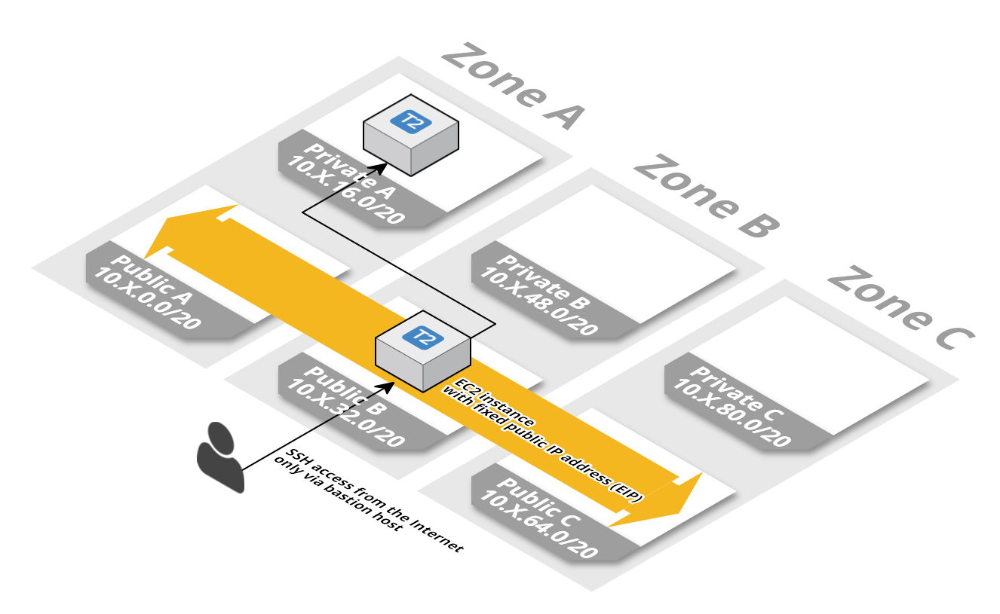
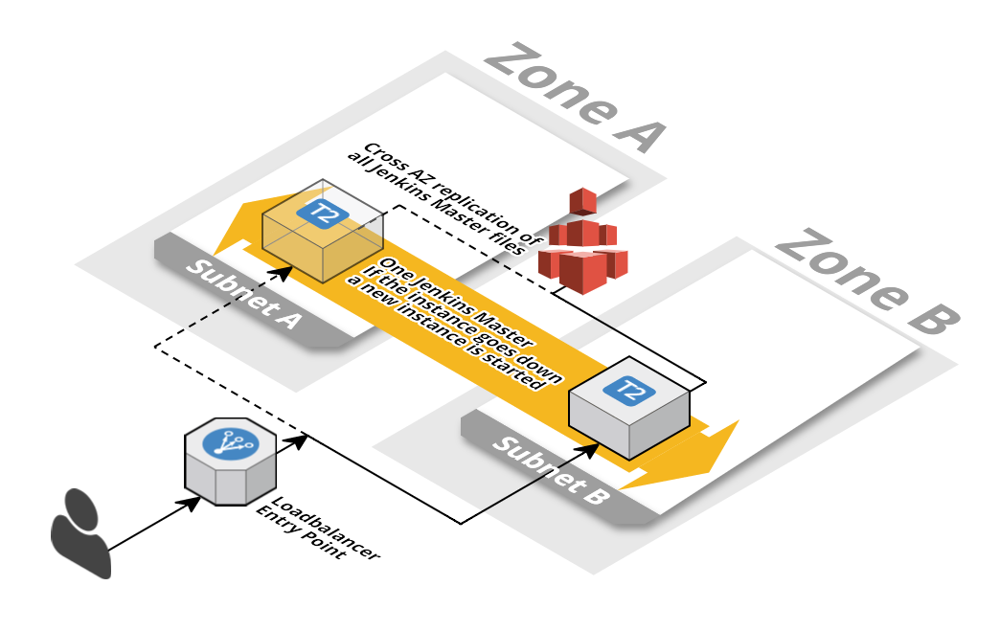

# Cloudformation Files

In order to quickly [get a Jenkins environment going](https://jira.hobsons.com/browse/NAWS-138), we used some CloudFormation scripts to get this started.

# Snapshot of Cloudformation files used from:

https://github.com/widdix/aws-cf-templates

These should be converted to Terraform as part of the AWS Account setup ([bootstrapping|https://jira.hobsons.com/browse/NAWS-138) task.

## VPC

This is made up of 4 Cloud Formation scripts that can be combined:

1. [VPC with 3 AZs with public/private subnets](vpc/vpc-3azs.yaml)

2. With additional [NAT Gateway](vpc/vpc-nat-gateway.yaml) Cloud Formation.

3. With access to S3 with [S3 Endpoint](vpc/vpc-endpoint-s3.yaml) from private subnets.

4. With additional [SSH Bastion](vpc/vpc-ssh-bastion.yaml) to access private subnets.

Documentation: http://templates.cloudonaut.io/en/stable/vpc/

## Jenkins HA

(This is a slightly newer version than last deployed, updated to Jenkins 2.46.2)

This depends on the VPC stacks above, and is a single Cloud Formation script:

1.  [Jenkins in High Availability Setup](jenkins/jenkins2-ha.yaml)
